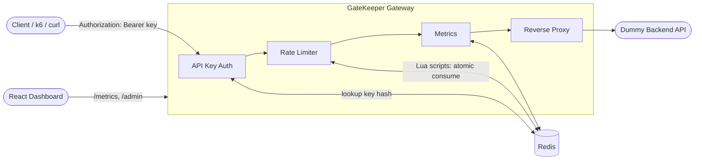

# GateKeeper

A rate-limited API gateway built from scratch to demonstrate backend engineering, Redis, distributed-systems fundamentals, and API design — built as a portfolio project for SDE internship applications.

GateKeeper sits between clients and a backend API, authenticates requests by API key, applies a per-client rate-limiting algorithm (Token Bucket or Sliding Window Log — both implemented from scratch, no rate-limiting libraries), and proxies allowed requests through.

```
Client → GateKeeper (auth → rate limit → proxy) → Backend API
                │
                ▼
              Redis (shared rate-limit state, API keys, metrics)

Dashboard → GateKeeper's own HTTP API (never touches Redis directly)
```

## Architecture



## Features

- API-key authentication (`Authorization: Bearer <key>`), keys stored as SHA-256 hashes, never plaintext
- Two rate-limiting algorithms, implemented from scratch, selectable per API key:
  - **Token Bucket** (burst-friendly)
  - **Sliding Window Log** (strict rolling quota)
- Atomic, race-condition-free rate-limit decisions via Redis Lua scripts
- Standard rate-limit headers (`X-RateLimit-*`) and correct `429` / `Retry-After` semantics
- Reverse proxy to a dummy backend, with request-ID propagation for cross-service log correlation
- Admin API for API key management (create / list / get / update limits / stats)
- Usage metrics (total/allowed/blocked, requests/sec, per-client breakdown)
- React dashboard: live overview, traffic chart, client table, and an interactive burst-test visualizer
- Docker Compose for all four services
- k6 load-test script covering normal, burst, and sustained traffic across both algorithms
- 31 automated tests (unit + integration), run against a real local Redis instance — no mocks for the parts that matter

## Tech Stack

**Gateway:** Node.js, TypeScript, Express, ioredis, Vitest, Supertest, http-proxy-middleware
**Backend:** Node.js, TypeScript, Express
**Dashboard:** React, TypeScript, Vite, Recharts
**Infra:** Docker, Docker Compose, Redis 7
**Load testing:** k6

## Token Bucket

Each client has a bucket holding up to `burstCapacity` tokens, refilling at `refillRate` tokens/second. Every request consumes one token; if none are available, the request is rejected.

```
tokens = min(capacity, tokens + elapsedSeconds * refillRate)
if tokens >= 1: allow, tokens -= 1
else: reject
```

This naturally allows bursts up to `burstCapacity` — a client that's been idle can send a full burst instantly, then must wait for tokens to trickle back in. Reference implementation: `apps/gateway/src/rate-limiters/token-bucket.pure.ts` (pure, unit-tested independently of Redis); production version: `apps/gateway/src/redis/lua/token-bucket.lua`.

## Sliding Window Log

Each client's recent request timestamps are stored in a Redis sorted set. On each request: drop timestamps older than the window, count what's left, reject if at the limit, otherwise record the new timestamp.

This is stricter than Token Bucket — there's no "saved up" allowance, only a literal rolling count of recent requests. It also uses more memory (one entry per request in the window, vs. two scalar fields for Token Bucket). Implementation: `apps/gateway/src/redis/lua/sliding-window.lua`.

| Property | Token Bucket | Sliding Window Log |
|---|---|---|
| Burst support | Yes, up to capacity | No — hard rolling cap |
| State per client | 2 fields (tokens, timestamp) | 1 entry per request in window |
| Memory | O(1) | O(requests in window) |
| Redis ops per request | 1 (via Lua) | 1 (via Lua), internally does ZREMRANGEBYSCORE + ZCARD + ZADD |
| Best for | APIs that tolerate bursts | APIs needing a strict quota |

## Redis Design

| Key pattern | Type | Purpose |
|---|---|---|
| `rate_limit:token_bucket:{clientId}` | Hash | `tokens`, `lastRefillMs` |
| `rate_limit:sliding_window:{clientId}` | Sorted set | member = unique request id, score = timestamp |
| `apikey:{id}` | Hash | key metadata (name, keyHash, config, createdAt) |
| `apikey_by_hash:{sha256}` | String | id, for O(1) auth lookup by key hash |
| `apikeys:index` | Set | all API key ids (for listing) |
| `metrics:total` / `metrics:allowed` / `metrics:blocked` | String (counter) | global counters |
| `metrics:client:{id}` | Hash | per-client total/allowed/blocked |
| `metrics:timeline` | Sorted set | recent request timestamps, used to derive requests/sec |

**TTL:** every rate-limit key gets an expiry so abandoned clients don't leave state in Redis forever. Token Bucket uses ~2× the time-to-refill-from-empty; Sliding Window uses the window length plus a small buffer. Once expired, a client that returns is treated as fresh (Token Bucket: full bucket; Sliding Window: empty history) — functionally indistinguishable from having been fully idle anyway.

## Atomicity

A naive `GET → calculate → SET` sequence has a race condition: two concurrent requests can both read the same token count, both decide they're allowed, and both decrement — over-serving the client. This is prevented by doing the entire read-calculate-write sequence inside a **Redis Lua script**, which Redis executes as a single atomic operation — no other client's command can interleave.

Both scripts also use Redis's own `TIME` command rather than each gateway instance's local clock, so refill/window math is consistent regardless of which instance (or how clock-drifted it is) handles a given request.

This is verified by real concurrency tests, not just asserted: `tests/token-bucket.redis.test.ts` and `tests/sliding-window.redis.test.ts` fire 15–20 concurrent requests at a nearly-empty bucket/window and assert that *exactly* the correct number are allowed.

## API Documentation

### Client-facing

All `/api/*` routes require `Authorization: Bearer <key>` and are rate-limited, then proxied to the backend.

```
GET  /health                     → { status: "ok" }
GET  /api/hello                  → proxied to backend
GET  /api/users                  → proxied to backend
GET  /api/products               → proxied to backend
POST /api/echo                   → proxied to backend
```

### Admin (requires `X-Admin-Key` header)

```
POST   /admin/api-keys                  create a client, returns plaintextKey (shown once)
GET    /admin/api-keys                  list all clients
GET    /admin/api-keys/:id              get one client
PATCH  /admin/api-keys/:id/limits       update a client's rate-limit config
GET    /admin/api-keys/:id/stats        usage stats for one client
```

### Metrics (public, read-only — polled by the dashboard)

```
GET /metrics/overview     global counters + requests/sec
GET /metrics/clients      per-client stats
```

## Rate-Limit Headers

On every rate-limited response:

- `X-RateLimit-Limit` — the client's configured ceiling (burst capacity or window limit)
- `X-RateLimit-Remaining` — requests/tokens left right now
- `X-RateLimit-Reset` — unix seconds when the allowance meaningfully resets (informational for Token Bucket, which has no hard window boundary; exact for Sliding Window)

On `429`:

- `Retry-After` — seconds to wait (a real HTTP standard, RFC 9110), plus a JSON body:
  ```json
  { "error": "rate_limit_exceeded", "message": "Too many requests", "retryAfter": 2 }
  ```

## Running Locally

Requires Node 22+ and a local Redis (or `docker compose up -d redis`).

```bash
npm install

# terminal 1
npm run dev -w apps/backend

# terminal 2
npm run dev -w apps/gateway
# gateway logs two seeded demo keys on first boot — save them, they're shown once

# terminal 3
npm run dev -w apps/dashboard
# opens on http://localhost:5173, proxies /admin, /metrics, /api to the gateway
```

## Docker

```bash
cp .env.example .env
# edit .env and set a real ADMIN_API_KEY, e.g.:
#   openssl rand -hex 24
docker compose up --build
```

Starts Redis, the gateway (`:3000`), the backend (`:4000`), and the dashboard (`:5173`).

**`ADMIN_API_KEY` has no hardcoded default in `docker-compose.yml`** — Compose reads it from your root `.env` file (gitignored, never committed) and refuses to start with a clear error if it's missing. This is intentional: a checked-in default secret in a public portfolio repo is a real credential leak, since anyone reading the repo would know it.

> **Note on verification:** the Dockerfiles and `docker-compose.yml` were written carefully and the compose file's YAML was validated for syntax correctness, but this project was built in a sandboxed environment without a Docker daemon available, so `docker compose up --build` itself has **not** been run by me. Everything else in this README (tests, gateway/backend/dashboard running directly with Node, real curl traffic through the full pipeline) has been actually executed and verified. Please run the Docker build yourself before relying on it.

## Testing

```bash
npm run test -w apps/gateway
```

31 tests, run against a real local Redis instance (DB 15, separate from dev data) — not mocked. Covers:

- Pure Token Bucket algorithm (7 tests): fill, consumption, exhaustion, refill math, capacity ceiling, burst behavior, retry calculation
- Redis-backed Token Bucket (5 tests): including a real 20-concurrent-request race condition check
- Redis-backed Sliding Window (5 tests): including a real 15-concurrent-request race condition check, and window rollover with a real `setTimeout`-based wait
- Admin API (6 tests): create/list/get/patch, plaintext-key-shown-once, hash never exposed, invalid config rejected
- Full pipeline integration (7 tests): 401 on missing/invalid key, real proxying to a real HTTP backend, headers, 429 + Retry-After, request-ID propagation, algorithm independence
- Health check (1 test)

## Load Testing

```bash
# with the gateway running and at least one Token Bucket + one Sliding Window key created
TOKEN_BUCKET_KEY=gk_... SLIDING_WINDOW_KEY=gk_... k6 run tests/load/gateway.js
```

Scenarios: normal traffic, burst traffic, sustained traffic, and sliding-window traffic, each against `/api/hello`. Reports requests/sec, latency percentiles, and rate-limited percentage.

> The k6 script's syntax has been checked (`node --check`), but k6 itself could not be installed in this sandboxed environment (no network access to its package source), so it has **not** been executed. Run it yourself and paste real output below.

## Benchmark Results

*(Intentionally left blank — do not fill this in with invented numbers. Run `k6 run tests/load/gateway.js` yourself and paste the actual output here.)*

```
requests/sec:
p50 latency:
p95 latency:
p99 latency:
error rate:
429 rate:
```

## Scaling Considerations

### Redis bottleneck
Every request costs one Redis round trip (the Lua script). At high throughput, Redis itself becomes the ceiling. Mitigations: Redis Cluster/sharding by client id, pipelining where requests can be batched, connection pooling (already using a single shared ioredis connection rather than per-request connections).

### Gateway scaling
The gateway itself is stateless — all shared state lives in Redis — so horizontal scaling is just "run more gateway instances behind a load balancer." This is *why* Redis exists instead of an in-memory Map: multiple instances need to agree on one client's token count.

### Hot API keys
One extremely high-traffic client creates a hot Redis key, since every one of that client's requests serializes through the same Lua script execution on the same key. Mitigation at real scale: shard a single logical client across multiple physical keys with a smaller sub-limit each, or move very hot clients to a coarser, approximate algorithm.

### Sliding Window memory
A high-volume client accumulates one sorted-set entry per request within the window — memory scales with (requests/sec × window length), unlike Token Bucket's constant 2 fields. Mitigation: cap window length for high-volume clients, or approximate with a bucketed/bloom-filter-style window instead of an exact log.

### Redis failure — fail open vs. fail closed
GateKeeper **fails open**: if Redis is unreachable, the rate-limit middleware catches the error, logs it, and lets the request through unrestricted rather than returning 500 to every client. Rationale: a temporarily-unenforced limit is a much smaller problem than the entire gateway going down because its dependency did. A stricter system (e.g., a payment API) might choose to fail closed instead — that's a legitimate, documented tradeoff, not a "right answer."

### Clock issues
Both Lua scripts use Redis's own `TIME` command rather than each gateway instance's local clock, specifically so refill/window math doesn't depend on clock sync across instances.

### Observability
At real scale you'd want Prometheus + Grafana for dashboards/alerting, OpenTelemetry for distributed tracing, and centralized structured log aggregation. This project's `MetricsService` is deliberately behind a small interface so it could be swapped for a Prometheus client later without touching call sites — but none of that infrastructure was added here, since it wouldn't teach anything new about rate limiting itself.

## Failure Modes / HTTP Status Semantics

| Status | Meaning here |
|---|---|
| 400 | Invalid admin request body |
| 401 | Missing or invalid API key |
| 403 | Missing or invalid admin credentials |
| 404 | API key not found |
| 429 | Rate limit exceeded |
| 500 | Unhandled gateway error |
| 502 | Backend unreachable (gateway itself is fine; upstream failed) |

## Security Considerations

**Implemented for this project:**
- API keys stored as SHA-256 hashes; plaintext shown only once, at creation
- Secrets via environment variables, `.env` gitignored
- Request body size capped (100kb) on admin routes
- Admin routes never return key hashes or plaintext in list/get responses
- No raw API keys ever logged — only their id
- CORS enabled (needed for the dashboard's dev-server proxy setup)

**Explicitly simplified for portfolio scope — not production-ready as-is:**
- Admin auth is a single shared secret in an env var (compared with `crypto.timingSafeEqual`, so at least the comparison itself isn't a timing side-channel). A production system still needs per-admin credentials, session/JWT auth, and RBAC — one shared secret for every admin action doesn't scale past a single trusted operator.
- No rate limiting on the admin API itself.
- `/metrics/*` is unauthenticated (read-only aggregate data, kept open for dashboard simplicity).
- No TLS termination configured (would sit behind a real load balancer/ingress in production).

## Future Improvements

- Redis Cluster for horizontal Redis scaling
- Prometheus/OpenTelemetry metrics export
- Per-admin authentication with RBAC
- Historical time-series storage for the dashboard (currently only shows a live in-memory window on the client)
- A third algorithm (e.g., Sliding Window Counter — an approximation that trades some accuracy for Token-Bucket-like memory usage)

## Interview Talking Points

See the accompanying chat summary for a full 60–90 second verbal walkthrough, 15+ likely interview questions with answers, and a scaling discussion at 10 / 1,000 / 10,000+ req/sec.
